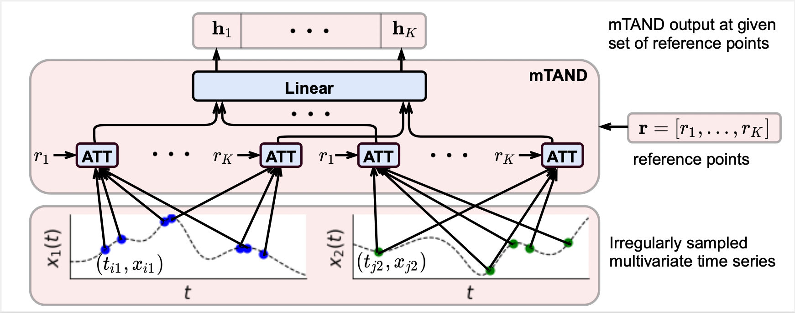
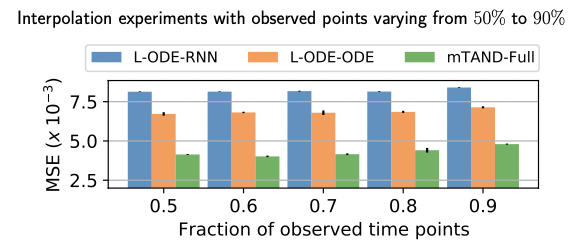
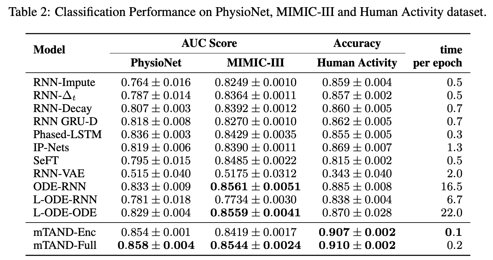

# Multi-Time Attention Networks (mTANs)
This repository contains the PyTorch implementation for the paper [Multi-Time Attention Networks for Irregularly Sampled Time Series](https://openreview.net/forum?id=4c0J6lwQ4_) by [Satya Narayan Shukla](https://satyanshukla.github.io/) and [Benjamin M. Marlin](https://people.cs.umass.edu/~marlin). This work has been accepted at the [International Conference on Learning Representations](https://iclr.cc/), 2021. 
<p align="center">
  
</p>

## Requirements
The code requires Python 3.7 or later. The file [requirements.txt](requirements.txt) contains the full list of
required Python modules.
```bash
pip3 install -r requirements.txt
```

## Training and Evaluation

1. Interpolation Task on Toy Dataset
```bash
python3 tan_interpolation.py --niters 5000 --lr 0.0001 --batch-size 128 --rec-hidden 32 --latent-dim 1 --length 20 --enc mtan_rnn --dec mtan_rnn --n 1000  --gen-hidden 50 --save 1 --k-iwae 5 --std 0.01 --norm --learn-emb --kl --seed 0 --num-ref-points 20 --dataset toy
```

2. Interpolation Task on PhysioNet Dataset 
```bash
python3 tan_interpolation.py --niters 500 --lr 0.001 --batch-size 32 --rec-hidden 64 --latent-dim 16 --quantization 0.016  --enc mtan_rnn --dec mtan_rnn --n 8000  --gen-hidden 50 --save 1 --k-iwae 5 --std 0.01 --norm --learn-emb --kl --seed 0 --num-ref-points 64 --dataset physionet --sample-tp 0.9
```

3. Classification Task on PhysioNet Dataset (mTAND-Full)
```bash
python3 tan_classification.py --alpha 100 --niters 300 --lr 0.0001 --batch-size 50 --rec-hidden 256 --gen-hidden 50 --latent-dim 20 --enc mtan_rnn --dec mtan_rnn --n 8000 --quantization 0.016 --save 1 --classif --norm --kl --learn-emb --k-iwae 1 --dataset physionet
```

4. Classification Task on PhysioNet Dataset (mTAND-Enc)
```bash
python3 tanenc_classification.py --niters 200 --lr 0.0001 --batch-size 128 --rec-hidden 128 --enc mtan_enc --n 8000 --quantization 0.016 --save 1 --classif --num-heads 1 --learn-emb --dataset physionet --seed 0
```

5. Classification Task on MIMIC-III Dataset (mTAND-Full)
```bash
python3 tan_classification.py --alpha 5 --niters 300 --lr 0.0001 --batch-size 128 --rec-hidden 256 --gen-hidden 50 --latent-dim 128 --enc mtan_rnn --dec mtan_rnn   --save 1 --classif --norm --learn-emb --k-iwae 1 --dataset mimiciii
```
For MIMIC-III Dataset, first you need to have an access to the dataset which can be requested [here](https://mimic.physionet.org/gettingstarted/access/). We follow the data extraction process described here: https://github.com/mlds-lab/interp-net. 

6. Classification  Task on MIMIC-III Dataset (mTAND-Enc)

```bash
python3 tanenc_classification.py --niters 200 --lr 0.0001 --batch-size 256 --rec-hidden 256 --enc mtan_enc  --quantization 0.016 --save 1 --classif --num-heads 1 --learn-emb --dataset mimiciii --seed 0
```
7. Classification  Task on Human Activity Dataset (mTAND-Enc)
```bash
python3 tanenc_classification.py --niters 1000 --lr 0.001 --batch-size 256 --rec-hidden 512 --enc mtan_enc_activity  --quantization 0.016 --save 1 --classif --num-heads 1 --learn-emb --dataset activity --seed 0 --classify-pertp
```

## Interpolation Results
Interpolation performance on PhysioNet with varying percent of observed time points:
<p align="center">
  
</p>

## Classification Results
Classification performance on PhysioNet, MIMIC-III and Human activity dataset, and time per epoch in minutes for all the methods on PhysioNet.
<p align="center">
  
</p>


## Reference
```bash
@inproceedings{
shukla2021multitime,
title={Multi-Time Attention Networks for Irregularly Sampled Time Series},
author={Satya Narayan Shukla and Benjamin Marlin},
booktitle={International Conference on Learning Representations},
year={2021},
url={https://openreview.net/forum?id=4c0J6lwQ4_}
}
```
